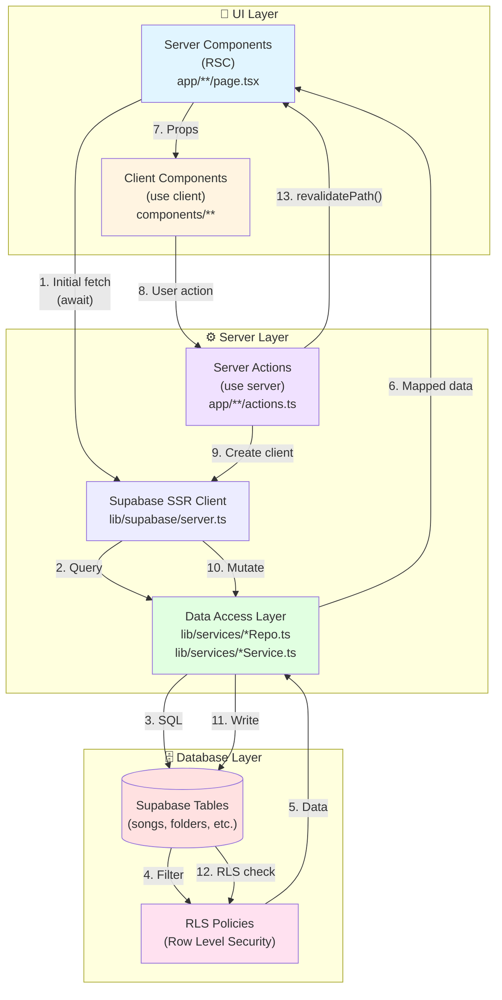

# Architecture, Flux et Conventions de Nommage

## Vue d'ensemble

Ce document explique l'architecture de l'application, le flux de données entre les composants, et les conventions de nommage à suivre pour maintenir un code cohérent et maintenable.

## Diagramme d'Architecture



## Flux de Données

### 📖 Lecture (Initial Render)

```
1. Server Component (RSC) se charge
   ↓
2. Crée le client Supabase SSR via createServerClientSupabase()
   ↓
3. Appelle les repos/services (songRepo, folderService, etc.)
   ↓
4. Les repos exécutent les requêtes Supabase
   ↓
5. RLS filtre automatiquement les données selon l'utilisateur
   ↓
6. Les données sont mappées (snake_case → camelCase)
   ↓
7. Les données sont passées comme props aux Client Components
   ↓
8. L'UI s'affiche
```

**Exemple concret :**

```tsx
// app/(protected)/dashboard/page.tsx (Server Component)
import { createServerClientSupabase } from '@/lib/supabase/server'
import { songService } from '@/lib/services/songService'
import { folderService } from '@/lib/services/folderService'

export default async function DashboardPage() {
  // 1. Créer le client SSR
  const supabase = await createServerClientSupabase()
  
  // 2. Fetch les données en parallèle
  const [songsResult, folders] = await Promise.all([
    songService.getAllSongs(supabase),
    folderService.getAllFolders(supabase)
  ])
  
  // 3. Passer les données au Client Component
  return <DashboardClient songs={songsResult.songs} folders={folders} />
}
```

### ✏️ Mutation (User Action)

```
1. User clique sur un bouton dans un Client Component
   ↓
2. Client Component appelle une Server Action
   ↓
3. Server Action crée le client Supabase SSR
   ↓
4. Appelle le repo/service pour la mutation
   ↓
5. RLS vérifie les permissions
   ↓
6. La mutation s'exécute
   ↓
7. revalidatePath() rafraîchit la page
   ↓
8. Le Server Component re-fetch les données
   ↓
9. L'UI se met à jour
```

**Exemple concret :**

```tsx
// app/(protected)/dashboard/actions.ts (Server Action)
'use server'
import { createServerClientSupabase } from '@/lib/supabase/server'
import { songRepo } from '@/lib/services/songRepo'
import { revalidatePath } from 'next/cache'

export async function addSongAction(payload: NewSongData) {
  // 1. Créer le client SSR
  const supabase = await createServerClientSupabase()
  
  // 2. Créer le repo avec le client
  const repo = songRepo(supabase)
  
  // 3. Exécuter la mutation
  await repo.createSong(payload)
  
  // 4. Revalider la page
  revalidatePath('/dashboard')
}
```

```tsx
// components/AddSongForm.tsx (Client Component)
'use client'
import { useTransition } from 'react'
import { addSongAction } from '@/app/(protected)/dashboard/actions'

export function AddSongForm() {
  const [pending, startTransition] = useTransition()
  
  const handleSubmit = () => {
    startTransition(async () => {
      await addSongAction({ title: '...', author: '...', content: '...' })
    })
  }
  
  return <button onClick={handleSubmit} disabled={pending}>Save</button>
}
```

## Structure de Fichiers et Conventions

### 📁 Structure Recommandée

```
src/
├── app/                          # Next.js App Router
│   ├── (protected)/              # Route groups (ne changent pas l'URL)
│   │   └── dashboard/
│   │       ├── page.tsx          # Server Component (RSC) - fetch initial
│   │       ├── actions.ts       # Server Actions (use server)
│   │       └── DashboardClient.tsx  # Client Component (use client)
│   ├── song/[id]/
│   │   ├── page.tsx             # Server Component
│   │   └── actions.ts           # Server Actions
│   └── api/                     # API Routes (pour intégrations externes, SSE)
│       └── playlists/
│           └── import/
│               └── route.ts     # API Route handler
│
├── components/                   # Composants React réutilisables
│   ├── containers/              # Client Components avec logique (hooks, state)
│   │   └── SongViewerContainerSSR.tsx
│   ├── presentational/          # Composants "dumb" (props uniquement)
│   │   ├── SongViewer.tsx
│   │   └── SongHeader.tsx
│   └── AddSongForm.tsx          # Client Components simples
│
├── lib/
│   ├── supabase/
│   │   └── server.ts           # createServerClientSupabase() - UNIQUEMENT serveur
│   ├── supabase.ts              # Client navigateur (createBrowserClient)
│   │
│   └── services/                # Data Access Layer
│       ├── songRepo.ts          # ✅ Repo explicite (client-injected)
│       ├── folderService.ts     # ✅ Service dossiers
│       ├── songService.ts       # ⚠️ Service legacy (client requis maintenant)
│       └── playlistService.ts   # Service playlists
│
├── types/
│   └── index.ts                 # Types TypeScript (Song, Folder, etc.)
│
└── utils/                       # Helpers purs (pas de dépendances Supabase)
    ├── songParser.ts
    └── structuredSong.ts

db/                              # Migrations et schémas SQL
├── supabase-setup.sql
└── fix-public-songs-rls.sql
```

### 🏷️ Conventions de Nommage

#### **Repos (Data Access avec client injecté)**

**Pattern :** `src/lib/services/<entity>Repo.ts`

```ts
// ✅ BON : Repo explicite avec client injecté
export const songRepo = (client: SupabaseClient) => ({
  async createSong(data: NewSongData): Promise<Song> { ... },
  async updateSong(id: string, updates: SongEditData): Promise<Song> { ... },
  async deleteSong(id: string): Promise<void> { ... }
})

// Usage
const supabase = await createServerClientSupabase()
const repo = songRepo(supabase)
await repo.createSong(payload)
```

**Conventions :**
- Nom du fichier : `<entity>Repo.ts` (ex: `songRepo.ts`, `folderRepo.ts`)
- Nom de la fonction : `<entity>Repo` (camelCase)
- Méthodes : verbes clairs (`createSong`, `updateSong`, `deleteSong`, `getAllSongs`, `getSongById`)

#### **Services (Data Access legacy/compatibilité)**

**Pattern :** `src/lib/services/<name>Service.ts`

```ts
// ⚠️ Service legacy (client requis, pas de fallback)
export const songService = {
  async getAllSongs(clientSupabase: SupabaseClient, page = 1, limit = 50) {
    // clientSupabase est REQUIS (pas de fallback)
    const { data: { user } } = await clientSupabase.auth.getUser()
    // ...
  }
}
```

**Conventions :**
- Nom du fichier : `<name>Service.ts` (ex: `songService.ts`, `playlistService.ts`)
- Nom de l'export : `<name>Service` (camelCase)
- Paramètre client : `clientSupabase` (obligatoire, pas de fallback)

#### **Server Actions**

**Pattern :** `app/**/actions.ts`

```ts
// ✅ BON : Server Action avec nommage clair
export async function addSongAction(payload: NewSongData) { ... }
export async function updateSongAction(id: string, updates: SongEditData) { ... }
export async function deleteSongAction(id: string) { ... }
export async function renameFolderAction(id: string, name: string) { ... }
```

**Conventions :**
- Nom du fichier : `actions.ts` (toujours dans le dossier de la route)
- Nom de la fonction : `<verb><Entity>Action` (camelCase)
  - Verbes : `add`, `update`, `delete`, `create`, `rename`, etc.
  - Entity : `Song`, `Folder`, `Playlist`, etc.
- Toujours préfixer avec `'use server'` en haut du fichier

#### **Server Components (RSC)**

**Pattern :** `app/**/page.tsx`

```tsx
// ✅ BON : Server Component par défaut (pas besoin de 'use server')
import { createServerClientSupabase } from '@/lib/supabase/server'
import { songService } from '@/lib/services/songService'

export default async function DashboardPage() {
  const supabase = await createServerClientSupabase()
  const songs = await songService.getAllSongs(supabase)
  return <DashboardClient songs={songs.songs} />
}
```

**Conventions :**
- Par défaut, tous les composants dans `app/` sont des Server Components
- Nom du fichier : `page.tsx` (pour les routes)
- Nom de la fonction : `<PageName>Page` (PascalCase)
- Ne pas utiliser `'use client'` sauf si nécessaire

#### **Client Components**

**Pattern :** `components/**/*.tsx` ou `app/**/*Client.tsx`

```tsx
// ✅ BON : Client Component avec 'use client'
'use client'
import { useTransition } from 'react'
import { addSongAction } from '@/app/(protected)/dashboard/actions'

export function AddSongForm() {
  const [pending, startTransition] = useTransition()
  // ...
}
```

**Conventions :**
- Toujours préfixer avec `'use client'` en haut du fichier
- Nom du fichier : `<ComponentName>.tsx` (PascalCase)
- Pour les pages client : `<PageName>Client.tsx` (ex: `DashboardClient.tsx`)

#### **Mapping DB → Domain**

**Pattern :** Dans les repos/services, mapper snake_case → camelCase

```ts
// ✅ BON : Mapping dans le repo
const { data } = await client.from('songs').select('*').single()

return {
  ...data,
  folderId: data.folder_id,        // snake_case → camelCase
  createdAt: new Date(data.created_at),
  updatedAt: new Date(data.updated_at),
  versionDescription: data.version_description,
  artistImageUrl: data.artist_image_url,
  // ...
}
```

**Conventions :**
- DB : `snake_case` (ex: `folder_id`, `created_at`, `user_id`)
- Domain : `camelCase` (ex: `folderId`, `createdAt`, `userId`)
- Mapper dans le repo/service, pas dans les composants

## Règles d'Or

### ✅ À FAIRE

1. **Initial fetch côté serveur** : Utilisez des Server Components pour charger les données initiales
2. **Mutations via Server Actions** : Toutes les mutations passent par des Server Actions
3. **Client injecté explicitement** : Les repos/services reçoivent le client Supabase en paramètre
4. **Un seul client serveur** : Utilisez `createServerClientSupabase()` partout côté serveur
5. **RLS comme sécurité primaire** : Laissez RLS filtrer, ne faites pas confiance au client
6. **Mapping centralisé** : Mapper DB → Domain dans les repos/services uniquement

### ❌ À ÉVITER

1. **Ne pas importer le client navigateur dans du code serveur**
2. **Ne pas faire de requêtes DB directement dans les Client Components** (sauf cas spéciaux : temps réel, SSE)
3. **Ne pas passer `userId` depuis le client** : Toujours lire via `client.auth.getUser()`
4. **Ne pas dupliquer la création du client serveur** : Utilisez le helper partagé
5. **Ne pas mapper dans les composants** : Le mapping se fait dans les repos/services

## Cas d'Usage Spéciaux

### Temps Réel / SSE

Pour les cas nécessitant du temps réel ou du streaming, vous pouvez utiliser le client navigateur directement :

```tsx
// ✅ OK : Client Component avec client navigateur pour temps réel
'use client'
import { supabase } from '@/lib/supabase'
import { songService } from '@/lib/services/songService'

useEffect(() => {
  // Incrémenter le compteur de vues (léger, idempotent)
  songService.incrementViewCount(song.id, supabase)
}, [song.id])
```

### API Routes

Utilisez les API Routes pour :
- Intégrations externes (webhooks, OAuth callbacks)
- Streaming Server-Sent Events (SSE)
- Clients non-React

```ts
// app/api/playlists/import/route.ts
import { createServerClientSupabase } from '@/lib/supabase/server'

export async function POST(req: Request) {
  const supabase = await createServerClientSupabase()
  // ...
}
```

## Checklist pour Nouveau Code

Quand vous ajoutez une nouvelle fonctionnalité :

- [ ] Le fetch initial est dans un Server Component ?
- [ ] Les mutations passent par des Server Actions ?
- [ ] Le client Supabase est injecté explicitement dans les repos/services ?
- [ ] Le mapping DB → Domain est fait dans le repo/service ?
- [ ] `revalidatePath()` est appelé après les mutations ?
- [ ] Les types TypeScript sont définis dans `types/index.ts` ?
- [ ] Le nommage suit les conventions (`<verb><Entity>Action`, `<entity>Repo`, etc.) ?

- [ ] Les Server Actions valident leurs entrées (ex: Zod) ?
- [ ] Les pages dépendantes de l'utilisateur évitent le cache statique (`noStore()` ou lecture de `cookies()`) ?
- [ ] Quand pertinent, utilisation de `revalidateTag()` pour une revalidation ciblée ?
- [ ] Les types DB sont générés et utilisés (Supabase CLI `gen types`) ?
- [ ] Aucun import du client navigateur (`lib/supabase`) dans du code serveur ?
- [ ] Les requêtes évitent `select('*')` en production (sélection de colonnes utile) ?
- [ ] Pagination efficace (keyset) pour les grandes listes ?
- [ ] Rate limiting présent sur les API sensibles ?
- [ ] Des tests d’intégration vérifient les policies RLS ?

## Bonnes Pratiques Avancées

### Sessions SSR Supabase (cookies)
- Utilisez un helper central (`createServerClientSupabase`) basé sur `@supabase/ssr` qui lit/écrit les cookies via `cookies()`/`headers()` de Next.js pour une session fiable côté serveur.
- Évitez toute duplication de création de client serveur.

### Caching et Revalidation
- Pour les pages dépendantes de l’utilisateur, désactivez le cache statique:

```ts
import { unstable_noStore as noStore } from 'next/cache'

export default async function Page() {
  noStore()
  // ... fetch user-scoped data
}
```

- Utilisez `revalidateTag()` pour des revalidations ciblées lorsque plusieurs vues dépendent des mêmes données:

```ts
import { revalidateTag } from 'next/cache'
// après mutation
revalidateTag(`songs:user:${userId}`)
```

### Validation des Entrées (Server Actions)
- Validez systématiquement la payload avec Zod (ou équivalent) dans les Server Actions:

```ts
import { z } from 'zod'

const NewSong = z.object({
  title: z.string().min(1),
  author: z.string().min(1),
  content: z.string().min(1),
})

export async function addSongAction(input: unknown) {
  const payload = NewSong.parse(input)
  // ... exécuter la mutation
}
```

### Types générés depuis la DB
- Générez les types à partir de Supabase (CLI) pour sécuriser les requêtes:
  - `supabase gen types typescript --project-id <id> > src/types/db.ts`
  - Importez ces types dans les repos pour typer résultats/selects/mappings.

### Repos vs Services
- Favorisez des repos explicites (client injecté) pour l’accès DB.
- Gardez les services pour l’orchestration multi-repos et la logique métier transverse.

### Performance
- Parallélisez les fetchs (`Promise.all`).
- Évitez N+1: utilisez des jointures/relations lorsque possible.
- Sélectionnez uniquement les colonnes utiles (évitez `*`).
- Privilégiez la pagination keyset pour des listes volumineuses.
- Ajoutez les index nécessaires côté DB.

### Sécurité additionnelle
- Ajoutez du rate limiting sur les routes d’API exposées publiquement.
- Unifiez/masquez les messages d’erreurs côté client.
- N’utilisez jamais de service role en runtime web (seulement scripts/outils).

### RLS/SQL
- Déplacez les invariants en DB: triggers `updated_at`, contraintes uniques, vérifications, policies idempotentes dans les migrations.

### Edge/Runtime
- Si certaines routes utilisent le runtime Edge, vérifiez la compatibilité des APIs et dépendances (notamment Node-only).

### Tests
- Ajoutez des tests d’intégration couvrant les policies RLS (utilisateurs factices, accès autorisé/refusé).

## Plan d’Audit de Conformité (à appliquer au repo)

1. Architecture & Clients
   - Vérifier que tout le code serveur utilise `createServerClientSupabase()` et n’importe pas `lib/supabase` (client navigateur).
   - Vérifier que toutes les Server Actions sont dans `app/**/actions.ts` et préfixées par `'use server'`.
2. Caching
   - Pour les pages user-scoped, confirmer la présence de `noStore()` ou d’une dépendance à `cookies()` pour éviter le cache statique.
   - Identifier les usages de `revalidatePath()` et envisager `revalidateTag()` si revalidation trop large.
3. Validation
   - Rechercher l’usage de Zod dans les Server Actions; ajouter si manquant.
4. Types DB
   - Vérifier l’existence de `src/types/db.ts` généré via Supabase CLI et son utilisation dans les repos.
5. Mapping & Data Layer
   - Confirmer que le mapping snake_case → camelCase est centralisé dans les repos/services.
   - S’assurer qu’aucun composant client ne fait de requêtes DB directes.
6. Sécurité
   - Vérifier la présence de rate limiting sur les API sensibles.
   - Vérifier l’absence de service role côté runtime web.
7. Performance
   - Requêtes évitent `select('*')`, usage de pagination et indexation adéquats.
   - Détecter des patterns N+1 et les corriger.
8. Tests
   - Vérifier l’existence de tests d’intégration des policies RLS.

### Commandes de vérification (suggestions)
- Import du client navigateur dans du code serveur:
  - `rg "from '@/lib/supabase'" src/app src/lib | rg -v '/lib/supabase/server'`
- Création du client serveur centralisée:
  - `rg "createServerClientSupabase\\(" src`
- Server Actions correctement déclarées:
  - `rg "app/.+/actions\\.ts" -n` et vérifier `'use server'` en tête de fichier
- Requêtes en composants:
  - `rg "\\.from\\(" src/components src/app | rg -v "app/.+/route\\.ts"`
- Validation Zod:
  - `rg "from 'zod'" src/app`
- Revalidation:
  - `rg "revalidate(Path|Tag)\\(" src/app`
- Sélection de colonnes (repérer `*`):
  - `rg "select\\('\\*'\\)" src/lib/services`
- Types DB générés:
  - vérifier `src/types/db.ts` et usages: `rg "types/db" src`

## Ressources

- [Next.js Server Components](https://nextjs.org/docs/app/building-your-application/rendering/server-components)
- [Next.js Server Actions](https://nextjs.org/docs/app/building-your-application/data-fetching/server-actions-and-mutations)
- [Supabase SSR Guide](https://supabase.com/docs/guides/auth/server-side/nextjs)
- [Supabase RLS](https://supabase.com/docs/guides/auth/row-level-security)

